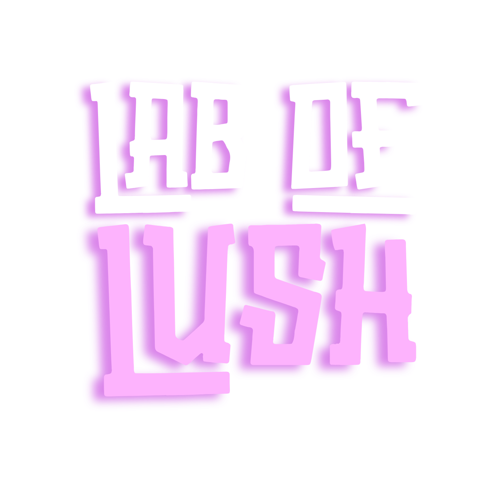

### Software Solutions & Consultancy

**We design, build, and ship software that teams actually want to use.**

From the first wireframe to production at scale, we partner with founders and
companies to turn ideas into reliable, beautiful, and maintainable products.

**Web** &nbsp;•&nbsp; **Mobile** &nbsp;•&nbsp; **Backend** &nbsp;•&nbsp; **DevOps**

---

## What we do

We're a full-stack product studio. We can own a project end to end, or plug
into your team to move a specific piece forward.

### 🌐 Web
Fast, accessible, and conversion-focused web applications. Marketing sites,
dashboards, and complex SPAs built with **React.js**, **TypeScript**,
**Next.js**, and **Vue** — designed to load quickly and scale gracefully.

### 📱 Mobile
Native-quality iOS and Android apps from a single codebase using
**React Native** and **Expo**. Smooth animations, offline support, push
notifications, and store-ready release pipelines.

### ⚙️ Backend
Scalable, data-driven systems built to hold up under real traffic. We design
microservices and RESTful APIs with **Python**, **FastAPI**, **Django**, and
**Flask** — backed by **PostgreSQL**, **MongoDB**, and **MySQL**. Our specialty
is the hard stuff: secure **OAuth 2.0** integrations across platforms (Google,
Meta, TikTok, Shopify), event-driven and distributed task processing with
**Celery**, **RabbitMQ**, **SQS**, and **EventBridge**, and advanced search
infrastructure on **Elasticsearch** and **OpenSearch**.

### ☁️ DevOps
Infrastructure that lets you ship with confidence. We run scalable container
orchestration on **AWS ECS** with auto-scaling and high availability, build
end-to-end **CI/CD** pipelines with **ECR** and **CodePipeline**, and ship
**zero-downtime blue/green deployments**. Add event-driven services on
**Lambda**, **S3**, and **CloudWatch**, **Docker + Nginx + SSL** deployments on
cloud VMs, and centralized logging for full observability — so releases are
boring (in the best way).

---

## How we work

- **Outcomes over output** — we optimize for the result you need, not lines of code.
- **Ship early, iterate often** — small, frequent releases beat big-bang launches.
- **Quality is built in** — tests, code review, and CI are part of the process, not an afterthought.
- **Clear communication** — you always know what's done, what's next, and why.

---

## Tech we love

---

## Let's build something great

Have a product idea, a system that needs scaling, or a team that needs an
extra pair of expert hands? We'd love to hear about it.

**📬 Get in touch — open an issue or reach out directly.**

*Lab of Lush — software, done right.*

